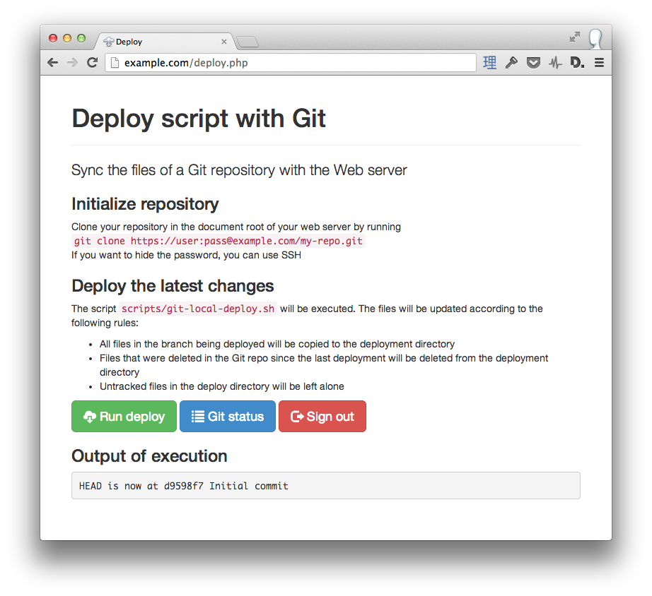
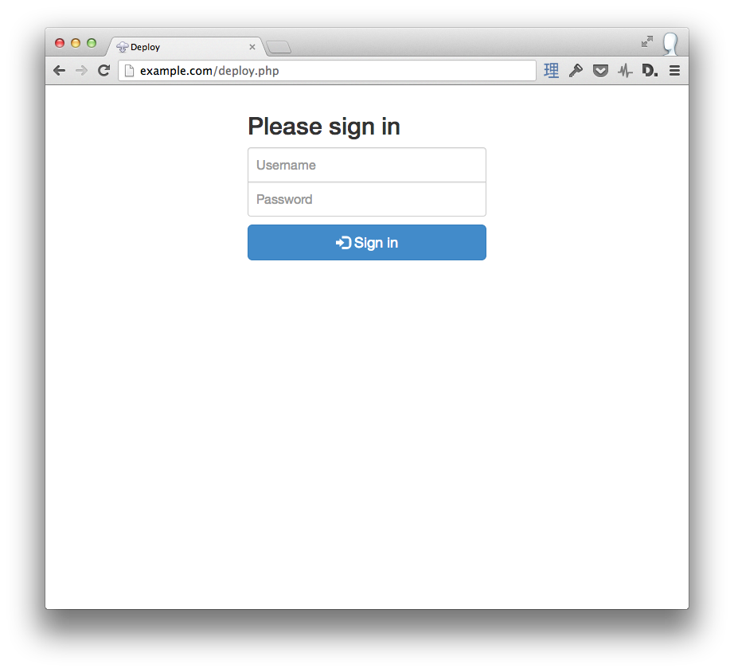

# Git Deploy PHP

Sync the files of a Git repository with the Web server according to the following rules:

* All files in the branch being deployed will be copied to the deployment directory
* Files that were deleted in the Git repo since the last deployment will be deleted from the deployment directory
* Untracked files in the deploy directory will be left alone

## Installation

1. Configure and copy **deploy.php** and **scripts** to the Git repository of your web application
2. Clone the Git repository in the web server
3. Deploy when you need

## How to deploy

### Web page

Open **deploy.php** in the web server, login and execute the deploy

### SSH

Login to the web server with SSH and execute **scripts/git-local-deploy.sh**  
Alternatively, you can configure and execute **scripts/git-remote-deploy.sh** in your local machine. This is a shortcut to execute **scripts/git-local-deploy.sh** in the web server

## Screenshots

  

## License

Released under the MIT License.
